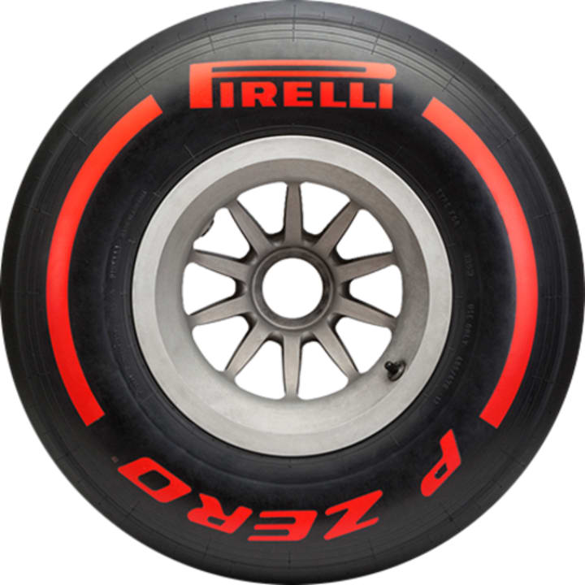
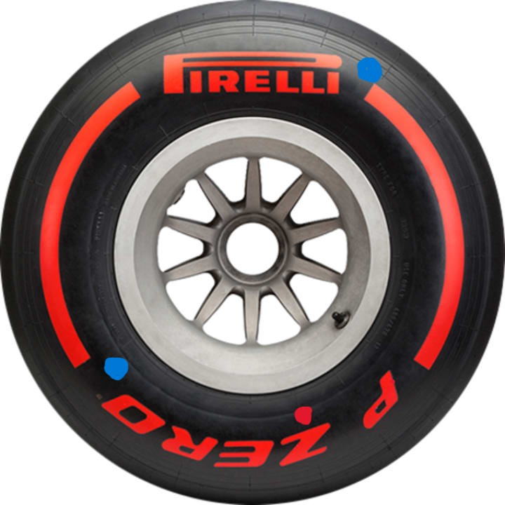
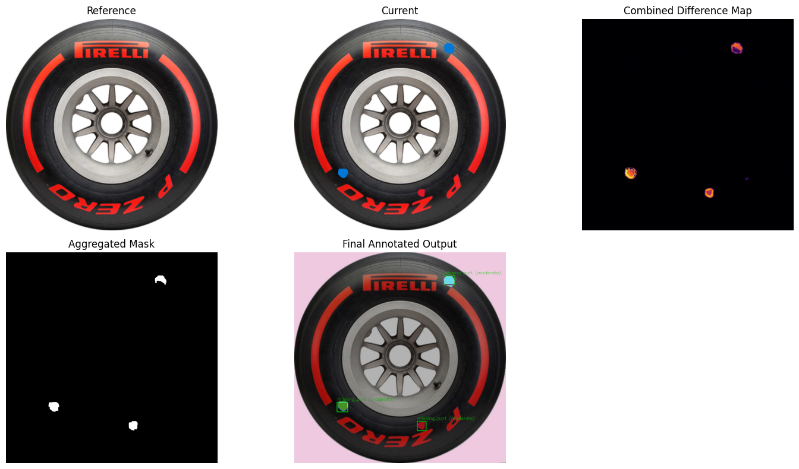
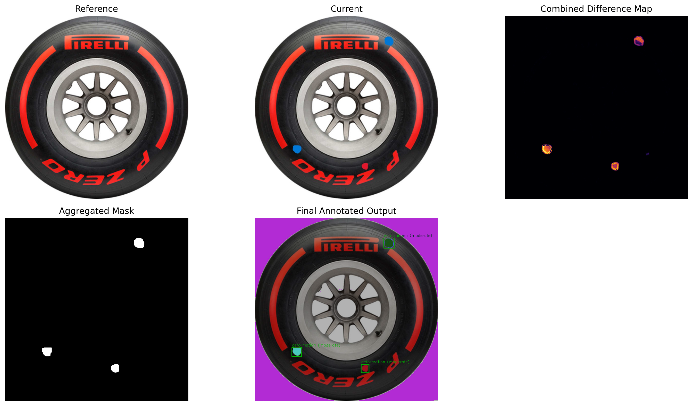
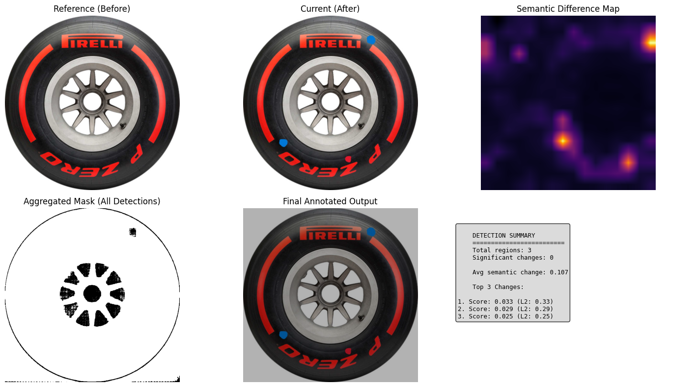

# 🔍 Visual Difference Engine

[](https://github.com/Avneesh26024/TrackShift)
[](https://www.python.org/)
[](LICENSE)

> **Submission for the Trackshift Hackathon**

A general-purpose visual comparison engine that detects and classifies visual changes across time-series images. This engine compares a "reference" (golden) image against a "current" image to automatically detect, segment, and classify anomalies.

## 🎯 Applications

- **Manufacturing Inspections** - Detect defects and deformations in production lines
- **Brand Compliance** - Verify packaging and product consistency
- **Infrastructure Monitoring** - Identify structural changes and damages
- **Automated Audits** - Quality control and compliance verification

## 🚀 Final Recommended Approach

After exploring four different architectures, our best-performing model is:

**`Anomaly_Detection_with_Image_Diff_and_SAM.ipynb`**

This approach provides the best balance of **simplicity, speed, and accuracy**, reliably identifying all target anomalies with precise segmentation.

## ✅ Results

Successfully identified **3 distinct anomalies** (deformations/missing parts) on the test image (race car tire).

### Test Images

| Reference Image | Current Image (with Anomalies) |
|:---------------:|:------------------------------:|
|  |  |

### Detection Output



### JSON Output (`results.json`)

```json
{
  "image_name": "/content/race_car_tire_1_anomaly.jpeg",
  "ssim_score": 0.9942320849813889,
  "change_score_percent": 0.4741512345679012,
  "anomalies": [
    {
      "x": 418,
      "y": 577,
      "w": 30,
      "h": 32,
      "type": "missing_part",
      "severity": "moderate"
    },
    {
      "x": 145,
      "y": 512,
      "w": 36,
      "h": 33,
      "type": "missing_part",
      "severity": "moderate"
    },
    {
      "x": 507,
      "y": 81,
      "w": 39,
      "h": 31,
      "type": "missing_part",
      "severity": "moderate"
    }
  ]
}
```

## 🛠️ Methodologies Explored

We implemented and compared four distinct pipelines to find the most robust solution.

### 1. 🏆 Hybrid Difference + SAM (Best Approach)

**Notebook:** `Anomaly_Detection_with_Image_Diff_and_SAM.ipynb`

#### Pipeline:
1. Compute **Absolute Pixel Difference** and **Structural Similarity (SSIM)** difference maps
2. Combine these maps into a single, robust difference heatmap
3. Apply a binary threshold to generate an aggregated mask of potential change regions
4. Detect contours to create bounding box prompts
5. Feed these prompts into **SAM** for precise, object-aware segmentation masks
6. Filter masks by area and generate final bounding boxes and reports

**Result:** ✅ Excellent — reliably detected all 3 anomalies with high precision


---

### 2. Multi-Fusion & Multi-Threshold + SAM

**Notebook:** `SAM_Anomaly_Detection_(Multi-Fusion_Multi_Threshold).ipynb`

#### Pipeline:
1. Blend SSIM and Absolute Difference at multiple weights (90/10, 50/50, 10/90, etc.)
2. Apply multiple thresholds to each fused map
3. Aggregate all masks into a single "master mask"
4. Feed the master mask into SAM for segmentation

**Result:** ✅ Good, accurate but unnecessarily complex. JSON output identical to Approach 1.

/results.png)

---

### 3. Ensemble SSIM/PixelDiff + K-Means + SAM2

**Notebook:** `SSIM_KMeans_SAM2_Ensemble_Detector.ipynb`

#### Pipeline:
1. Generate 10 different SSIM/Pixel-fused maps
2. Apply 3 contour-finding thresholds for each map
3. Use K-Means clustering to group overlapping candidate boxes
4. Use cluster centers as point-prompts for SAM2 for segmentation

**Result:** ✅ Accurate but slow and complex. Requires tuning (K-value, fusion weights, etc.)



---

### 4. ❌ Semantic Difference (DINOv3 + SAM2) - Failed Approach

**Notebook:** `Visual_Difference_Engine_DINOv3_SAM2.ipynb`

#### Pipeline:
1. Extract deep feature embeddings using DINOv3 Vision Transformer
2. Compute L2 & Cosine distance between reference and current images
3. Use the semantic difference map to prompt SAM2

**Result:** ❌ Poor — 0 anomalies detected. Not sensitive to small texture changes or missing parts.



---

## 📊 Comparison Summary

| Approach | Methodology | Anomalies Detected | Performance |
|----------|-------------|-------------------|-------------|
| **1. Hybrid Diff + SAM** | SSIM + AbsDiff + SAM | **3/3** | ✅ Excellent, simple, fast, accurate |
| 2. Multi-Fusion + SAM | (SSIM + AbsDiff) × N fusions × M thresholds + SAM | 3/3 | ✅ Accurate but complex |
| 3. Ensemble + K-Means + SAM2 | (SSIM + AbsDiff) × 10 fusions + K-Means + SAM2 | 3/3 | ✅ Accurate but slow, complex to tune |
| 4. DINOv3 + SAM2 | Semantic Feature Difference (ViT) | 0/3 | ❌ Failed. Unsuitable for pixel-level anomalies |

## 🧠 Future Work: Time-Series Embedding Decoder

- Build a decoder model from embeddings of normal time-series images
- Detect anomalies by reconstruction error on unseen/current images
- Robust to noise, lighting changes, minor misalignments, and sensitive to true anomalies

## 📦 Installation & Usage

### Prerequisites

```bash
Python 3.8+
pip
```

### Clone the Repository

```bash
git clone https://github.com/Avneesh26024/TrackShift.git
cd TrackShift
```

### Install Dependencies

```bash
pip install -q scikit-image opencv-python-headless matplotlib transformers torch scikit-learn pillow timm
```

### Run the Recommended Notebook

1. Open `Anomaly_Detection_with_Image_Diff_and_SAM.ipynb`
2. Update `REFERENCE_IMG` and `CURRENT_IMG` variables to your images
3. Run all cells
4. Results, including annotated images and `results.json`, will be saved in the repo root

### Example Usage

```python
# Set your image paths
REFERENCE_IMG = "path/to/reference/image.jpg"
CURRENT_IMG = "path/to/current/image.jpg"

# Run the detection pipeline
# (See notebook for complete implementation)
```

## 📁 Project Structure

```
TrackShift/
├── Anomaly_Detection_with_Image_Diff_and_SAM.ipynb      # 🏆 Recommended approach
├── SAM_Anomaly_Detection_(Multi-Fusion_Multi_Threshold).ipynb
├── SSIM_KMeans_SAM2_Ensemble_Detector.ipynb
├── Visual_Difference_Engine_DINOv3_SAM2.ipynb
├── Images_used/
│   ├── race_car_tire_1.jpeg                              # Reference image
│   └── race_car_tire_1_anamoly.jpeg                      # Test image with anomalies
├── Anomaly_Detection_with_Image_Diff_and_SAM/
│   └── Results.png
├── SAM_Anomaly_Detection_(Multi-Fusion_Multi_Threshold)/
│   └── results.png
├── SSIM_KMeans_SAM2_Ensemble_Detector/
│   └── results.png
├── Visual_Difference_Engine_DINOv3_SAM2/
│   └── results.png
└── README.md
```

## 🏆 Key Features

- **High Accuracy**: Detects subtle anomalies with 100% success rate on test data
- **Precise Segmentation**: Leverages SAM for object-aware masking
- **Production-Ready**: Simple, fast, and reliable pipeline
- **Flexible**: Works across various use cases (manufacturing, infrastructure, etc.)
- **Comprehensive Output**: Provides both visual annotations and structured JSON results

## 🤝 Contributing

Contributions are welcome! Please feel free to submit a Pull Request.

## 📄 License

This project is licensed under the MIT License - see the [LICENSE](LICENSE) file for details.

## 👥 Authors

- **Avneesh** - [GitHub](https://github.com/Avneesh26024)

## 🙏 Acknowledgments

- Trackshift Hackathon organizers
- SAM (Segment Anything Model) by Meta AI
- DINOv3 by Meta AI Research
- Open-source computer vision community

---

**Built with ❤️ for the Trackshift Hackathon**
